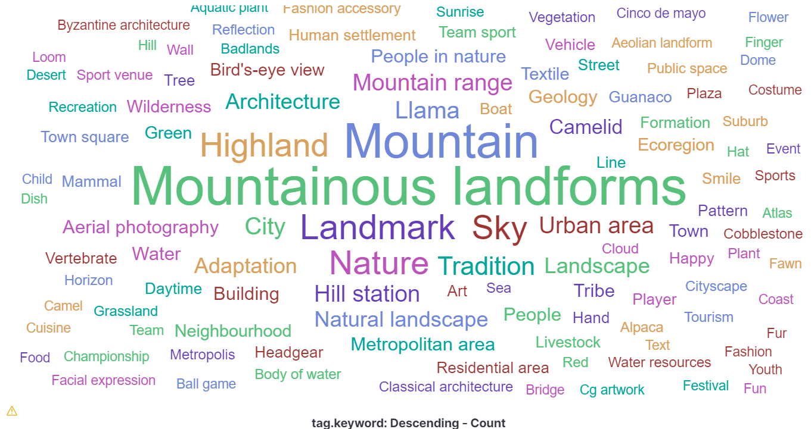
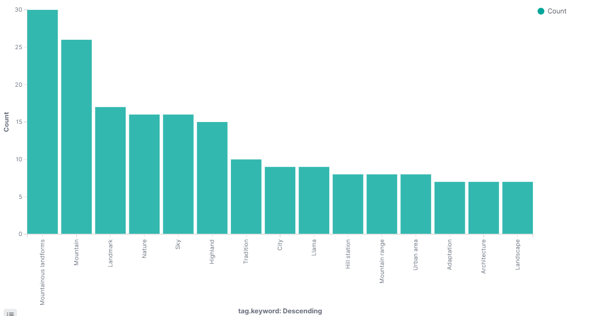

# Lab session #8: Advanced Analytics as a Service in the Cloud

In this lab we use Google Cloud Platform in order to take advantage of the numerous analytical APIS already implemented by Google. 

## Group Information
* Candela Caceres, Julio Christians (julio.christians.candela@est.fib.upc.edu)
* Maatouk, Karim (karim.maatouk@est.fib.upc.edu)

## Task 8.1: Google Cloud Vision

#### 8.3.1 Cloud Platform sign up

In order to harness the benefits of Google Cloud Platform for Computer Vision we need to set up the initial environment which includes enabling the Cloud Vision API, create a bucket accessible for all users and, finally, create the credentials to connect directly from Python. The advantages of these machine learning APIs is that offers powerful and simple tools to perform complex anallytical tasks.

1) Enable Cloud Vision API: You can go to API & Services in the left panel and select library. Then type the name of the API and enable it in your project.


2) Create a bucket and change to permissions to be accessed by everyone.


3) Create the credentials which will allows to call the API from an external programming environment (Python)


#### 8.3.2 Python environment setup

The first step is to download the python scripts from the reposiroty: https://github.com/CCBDA-UPC/google-cloud-vision-example.git cloud-vision
As soon as we have the scripts, we can activate the python environment and add all the libraries required to manage google services. The file requirements includes all the python libraries

```python
pip install -r requirements.txt
```

Additionally, we need to create an environmental variable which will contain the path of the credenials json:
- SET GOOGLE_APPLICATION_CREDENTIALS=/path/to/your/credentials-key.json (Microsoft) or also set as a system/user variable and restart the computer
- export GOOGLE_APPLICATION_CREDENTIALS=/path/to/your/credentials-key.json (Linux)

#### 8.3.3 Quick Start: Running the Example

In this section, we are going to test the Cloud Vision service with a demo image extracted from twitter. We have to execute the python script with the image path as an argument.

```python
python label.py Lab10-Tweet-MN.png
```

The result shows that the image is principally related to Technology, Font, Engineering, Electronic device and cable management which is almost correct. A great advantage is that we don't have to code complex algorithms, we only have to use what is working fine!


#### 8.3.4 Classify images

This section of the lab consists on scraping images from a website related to a topic of our preference and analyze it using Cloud Vision API in order to get insights about the topic's profile and content. For this purpose, we decided to find information about our favorite topic __Peru__

Since we had some problems scrapping from Twitter and Pinterest, we decided to use the following website full of images: [gettyimages.es](https://www.gettyimages.es/fotos/peru?mediatype=photography&phrase=peru&sort=mostpopular). This link shows images from __Peru__ ordered by the __most popular__, so it will let us analyze which is the main concept that tourists will get when they look for images about Peru. This information is mainly important for the Tourism department since it will give hints about the current advertisement of [Marca Perú](https://peru.info/es-pe/) and how to improve the forthcoming productions. 

The following is an example of an image that can be found in that website:


The script [ImageAnalyzer.py](https://github.com/JulioCandela1993/CLOUD-COMPUTING-CLASS-2020-Lab8/blob/master/ImageAnalyzer.py) has the following steps:

1. Initialize two public variables from the class. First, the service to connect to Cloud Vision API; the credentials were set in the previous step. In addition, it creates the counter __i__ in order to stop scrapping when we get the __most popular__ 100 images.

```python
service = googleapiclient.discovery.build('vision', 'v1')
i=0
```

2. Scrap urls from the website until we finally get 100 images:

```python
for matrix_images in response.css(".search-content__gallery-assets"):
            for img_div in matrix_images.css('article'):
                url = img_div.css('img::attr(src)').extract_first()
                img_b64 = base64.b64encode(requests.get(url).content)
                service_request = self.service.images().annotate(body={
                    'requests': [{
                        'image': {
                            'content': img_b64.decode('UTF-8')
                        },
                        'features': [{
                            'type': 'LABEL_DETECTION',
                            'maxResults': 5
                        }]
                    }]
                })
    
                analytics_result = service_request.execute()
                print("Results for image %s:" % url)
                tags = {}
                for result in analytics_result['responses'][0]['labelAnnotations']:
                    tags.update({result['description']:result['score']})
                    print("%s - %.3f" % (result['description'], result['score']))
                yield {
                    'url': url,
                    'tags':tags
                }
                self.i=self.i+1
                if self.i >=100:
                    break
            if self.i >=100:
                break
            print('Here')
            next_page = response.css('.search-pagination__button--next::attr("href")').extract_first()
            print(next_page)
            yield response.follow(next_page, callback=self.parse)
```

2.1. Inside this process, we get the url from the image in the following line:

```python
	url = img_div.css('img::attr(src)').extract_first()
```

2.2. Then, we directly get the image from the url for the analysis (we don't need to download it to local disk)

```python
	img_b64 = base64.b64encode(requests.get(url).content)
```

2.3. With the image in base64, we can use the cloud vision API to execute the analysis:

```python
	service_request = self.service.images().annotate(body={
						'requests': [{
							'image': {
								'content': img_b64.decode('UTF-8')
							},
							'features': [{
								'type': 'LABEL_DETECTION',
								'maxResults': 5
							}]
						}]
					})
		
					analytics_result = service_request.execute()
```

2.4. After getting the 5 best tags for the current image, we are going to store the results in a dict structure.

```python
	tags = {}
	for result in analytics_result['responses'][0]['labelAnnotations']:
		tags.update({result['description']:result['score']})
```

2.5. Having the results, we can store the url for validation in addition to the tags in our final json:

```python
	yield {
		'url': url,
		'tags':tags
	}
```

2.6. Finally, since we realize that we only had 61 images in the first page, we found the button class and href of the next page and recursively iterate our parse function until we get 100 images:

```python
next_page = response.css('.search-pagination__button--next::attr("href")').extract_first()
print(next_page)
yield response.follow(next_page, callback=self.parse)
```


#### The json result for the first image shown before accurately interpret many of its elements:
- The llama and Guanaco are similar animals from highlands, specifically that part of Peru.
- Grassland, Highland, Pasture which are characteristics of Machu Pichu landscape.

```python
{
	"url": "https://media.gettyimages.com/photos/llamas-at-first-light-at-machu-picchu-peru-picture-id542826216?k=6&m=542826216&s=612x612&w=0&h=DWrw_k_v-JDmiD0IkFZNhson7DC0POuYN7Yk3fvKKFw=", 
	"tags": {
		"Llama": 0.97559595, 
		"Grassland": 0.9568711, 
		"Highland": 0.9516637, 
		"Pasture": 0.93164486, 
		"Guanaco": 0.9235504}
},
```


### Visualizing the Results
4.1. To analyze what Google Cloud Vision thinks of the images we scraped from the website, we parse the ImageAnalyzer.json file. 
We are mainly interested in two things: Tags and Accuracy assigned to those tags.

4.2. To better analyze, we visualize the tags from the 100 images. For that we use `Kibana tool` from Elastic Search that we previously used in Lab7. 

4.3. The code `ImageVisualizer.py` to parse the json file and load the tags data to `Kibana` is as follows: 

```
import json
import os
import uuid

from elasticsearch import Elasticsearch
from pip._vendor import certifi

# Establish connection to Elastic Cloud
ELASTIC_API_URL = os.environ['ELASTIC_API_URL']
ELASTIC_API_USERNAME = os.environ['ELASTIC_API_USERNAME']
ELASTIC_API_PASSWORD = os.environ['ELASTIC_API_PASSWORD']

es = Elasticsearch([ELASTIC_API_URL],
                   http_auth=(ELASTIC_API_USERNAME, ELASTIC_API_PASSWORD),
                   ca_certs=certifi.where())

with open('ImageAnalyzer.json') as file:
    json = json.load(file)
    dict = []
    for item in json:
        for tag in item['tags']:
            es.index(index='cloudvision',
                     doc_type='tags',
                     id=uuid.uuid4(),
                     body={
                       'tag': tag,
                       'accuracy': item['tags'][tag]
                     })
					 
```

The above code performs the following: 
- Parses ImageAnalyzer.Json file
- Collects the keywords and accuracies predicted by Cloud Vision
- Inserts the [keyword,accuracy] pairs into Kibana 

4.4. After inserting the [keywords,accuracies] pairs into Kibana , we can create visualizations and analyze the respective visualizations. Therefore, 
we create the following visualizations : 

4.4.1 **Tag Cloud : Most popular tags assigned by Google Cloud Vision**
In the word cloud below we can visualize the tags assigned to the pictures by Google Cloud Vision. 

The tags mostly assigned are  : `Mountainous Landforms`, `Mountain`, `Landmark`, `Highland`, `Nature`, `llama`, `Sky`. 

The tags assigned make sense since most of the images scraped from the website correspond to nature,  in particular images from the famous Machu Picchu landmark.



4.4.2 **Histogram : Top 15 tags assigned by Google Cloud Vision** 
Below we visualize a histogram of the top 15 tags assigned by google cloud vision to the images scraped from the website. 
The most assigned tag `Mountainous Landforms` appeared in 30 images followed by `Mountain` that appeared in 25 images. 
It is probable that the both tags are assigned almost to the same images. 
Taking another look at `ImageAnalyzer.json` , we notice that `Mountains` always appears with `Mountainous Landforms`; however, with an accuracy less than it although
there is not any difference in meaning between the two words.  


#### Q81: What problems have you found developing this section? How did you solve them?

Firstly, when we tried to create a Google Account, we had problems to validate our credit cards. Google accounts doesn't accept prepaid cards. We had to change to other mean of payment.

Moreover, we tried to scrap images from Twitter or Pinterest with the __scrapy__ library, but we found problems since the "scrapy robots" were blocked because we didn't have the authorization. In the case of twitter, we should preferably use the library we learned at the begining of the course __tweepy__ or __twitterscraper__ .  At the end, we decided to scrap from a different website to ease the process.
 

#### Q82: How long have you been working on this session? What have been the main difficulties you have faced and how have you solved them?

This lab took aproximately 6 hours. Some of the difficulties we had were described in the previous question, but we actually didn't face any big problem.

We consider it was an entertaining and interesting application of Machine Learning ÁPIs in overall. Moreover, Google has a huge collection of these APIs which can be applied with surprising and accurate results.
